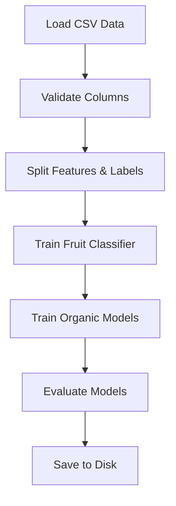

# Pocket Organic Tester API

A Flask-based machine learning backend application for spectral analysis and organic food detection. This system uses optical spectroscopy data (8 spectral channels) to classify fruits and determine whether they are organic or non-organic.

## Table of Contents

- [Project Overview](#project-overview)
- [Project Structure](#project-structure)
- [Technology Stack](#technology-stack)
- [Detailed Code Explanation](#detailed-code-explanation)
- [Installation & Setup](#installation--setup)
- [Running the Application](#running-the-application)
- [API Documentation](#api-documentation)
- [Model Training](#model-training)
- [Example Usage](#example-usage)

---

## Project Overview

The Pocket Organic Tester API is a production-ready Flask backend that:
- **Classifies fruits** (Apple, Banana, Tomato) based on spectral signature data
- **Detects organic vs non-organic** produce using machine learning
- **Provides REST API endpoints** for real-time predictions
- **Uses Random Forest models** trained on synthetic spectral data

### How It Works

1. **Data Collection**: 8 spectral channels (F1-F8) simulate optical spectroscopy sensor readings
2. **Fruit Classification**: A Random Forest classifier identifies the fruit type
3. **Organic Detection**: Fruit-specific models predict organic status
4. **API Response**: Returns fruit type, organic status, and confidence scores

---

## Project Structure

```
pocket-organic-tester/
│
├── app.py                      # Flask application entry point
├── config.py                   # Configuration management (Dev/Prod/Test)
├── requirements.txt            # Python dependencies
│
├── data/                       # Dataset directory
│   ├── synthetic_data.csv      # Training dataset (1200 samples)
│   └── generate_dataset.py     # Script to regenerate dataset
│
├── models/                     # Machine learning models
│   ├── train_models.py         # Model training script
│   ├── predict.py              # Prediction logic
│   ├── fruit_model.pkl         # Trained fruit classifier (created after training)
│   ├── label_encoder.pkl       # Label encoder (created after training)
│   └── organic_models.pkl      # Organic classifiers dict (created after training)
│
└── routes/                     # API route handlers
    └── scan_routes.py          # Blueprint for /api/scan endpoint
```

---

## Technology Stack

| Technology       | Version  | Purpose                                    |
|------------------|----------|--------------------------------------------|
| Flask            | ≥3.0.0   | Web framework for REST API                 |
| flask-cors       | ≥4.0.0   | Cross-Origin Resource Sharing support      |
| pandas           | ≥2.0.0   | Data manipulation and CSV loading          |
| numpy            | ≥1.24.0  | Numerical computations                     |
| scikit-learn     | ≥1.3.0   | Machine learning models & preprocessing    |
| joblib           | ≥1.3.0   | Model serialization/deserialization        |

---

## Detailed Code Explanation

### 1. `app.py` - Flask Application Entry Point

**Purpose**: Initializes and runs the Flask API server.

**Key Components**:
- **Application Factory**: `create_app()` function for flexible configuration
- **Configuration Loading**: Environment-based config (development/production/testing)
- **CORS Setup**: Enables cross-origin requests for `/api/*` endpoints
- **Blueprint Registration**: Registers `scan_bp` for API routes
- **Error Handlers**: Global error handling for 404, 500, and uncaught exceptions
- **Root Endpoint**: Health check at `/` returning API status

**Code Highlights**:
```python
def create_app(config_name=None):
    app = Flask(__name__)
    app.config.from_object(config[config_name])  # Load config
    CORS(app, resources={r"/api/*": {...}})      # Enable CORS
    app.register_blueprint(scan_bp)              # Register routes
    return app
```

**Run Configuration**:
- Listens on `0.0.0.0:5000` (all network interfaces)
- Debug mode enabled in development
- Auto-reloader for code changes in development

---

### 2. `config.py` - Configuration Management

**Purpose**: Manages environment-specific settings for Flask application.

**Configuration Classes**:

#### Base `Config` Class
- `SECRET_KEY`: Session encryption key (loads from environment or default)
- `MODEL_PATH`: Directory for saved ML models (`models/`)
- `MAX_CONTENT_LENGTH`: Upload size limit (16 MB)
- `JSON_SORT_KEYS`: JSON response formatting
- `CORS_HEADERS`: Allowed headers for CORS

#### `DevelopmentConfig`
- `DEBUG = True`: Enables Flask debugger
- `TESTING = False`
- `ENV = 'development'`

#### `ProductionConfig`
- `DEBUG = False`: Disables debugger for security
- `SECRET_KEY`: **Required** from environment variable (raises error if missing)
- `ENV = 'production'`

#### `TestingConfig`
- `DEBUG = True`, `TESTING = True`
- Used for unit testing

**Usage**: Config is selected via `FLASK_ENV` environment variable or defaults to development.

---

### 3. `data/synthetic_data.csv` - Training Dataset

**Purpose**: Contains 1200 synthetic spectral samples for model training.

**Dataset Structure**:
| Column      | Type   | Description                                      |
|-------------|--------|--------------------------------------------------|
| Sample_ID   | string | Unique identifier (e.g., `Apple_Org_042`)       |
| F1-F8       | float  | Spectral channel values (reflectance, 0-1 range) |
| Fruit       | string | Fruit type (Apple, Banana, Tomato)              |
| Organic     | string | Organic status (Organic, Non-Organic)           |

**Dataset Composition**:
- **Total Samples**: 1200
- **3 Fruits**: Apple, Banana, Tomato (400 samples each)
- **200 Organic + 200 Non-Organic** per fruit
- **Spectral Signatures**: Each fruit has distinct reflectance patterns
  - **Apple**: Mid-range reflectance (0.38-0.62)
  - **Banana**: High reflectance (0.62-0.85)
  - **Tomato**: Variable reflectance (0.35-0.68)
- **Organic Differences**: Organic samples have slight spectral shifts (+0.01 to +0.03)

**Regenerate Dataset**:
```bash
python3 data/generate_dataset.py
```

---

### 4. `data/generate_dataset.py` - Dataset Generator

**Purpose**: Creates synthetic spectral data simulating optical spectroscopy measurements.

**Key Features**:
- **No External Dependencies**: Uses only Python standard library (csv, random, math)
- **Reproducible**: Fixed random seed (42) for consistent dataset generation
- **Realistic Simulation**: 
  - Base spectral signatures per fruit
  - Gaussian noise (σ=0.025) for natural variation
  - Organic shifts to simulate soil/cultivation differences
  - Value clipping to [0, 1] range

**Algorithm**:
1. Define base spectral signatures for each fruit
2. Define organic shift patterns
3. Generate Non-Organic samples: base + noise
4. Generate Organic samples: base + organic_shift + noise
5. Shuffle and save to CSV

---

### 5. `models/train_models.py` - Model Training Pipeline

**Purpose**: Loads CSV data, trains ML models, and saves them to disk.

**Main Functions**:

#### `load_data(csv_path)`
- Loads CSV file from `../data/synthetic_data.csv`
- Validates required columns (F1-F8, Fruit, Organic)
- Prints dataset statistics
- Returns pandas DataFrame

#### `train_fruit_model(df)`
- **Task**: Multi-class classification (3 fruits)
- **Model**: RandomForestClassifier
  - 100 trees
  - Max depth: 10
  - All CPU cores (`n_jobs=-1`)
- **Features**: F1-F8 spectral channels
- **Label Encoding**: LabelEncoder for fruit names
- **Train/Test Split**: 80/20 with stratification
- **Output**: Trained model, label encoder, accuracy
- **Evaluation**: Classification report + feature importance

#### `train_organic_models(df)`
- **Task**: Binary classification per fruit (Organic vs Non-Organic)
- **Models**: 3 separate RandomForestClassifiers (one per fruit)
- **Rationale**: Each fruit has unique organic signatures
- **Features**: F1-F8 spectral channels
- **Train/Test Split**: 80/20 per fruit with stratification
- **Output**: Dictionary of models (keyed by fruit name)

#### `save_models(fruit_model, label_encoder, organic_models)`
- Uses `joblib.dump()` for efficient serialization
- Saves 3 files:
  - `fruit_model.pkl`: Fruit classifier
  - `label_encoder.pkl`: Fruit name encoder
  - `organic_models.pkl`: Dictionary of organic classifiers

**Training Process**:
```
1. Load CSV data
2. Train fruit classification model
3. Train 3 organic detection models (one per fruit)
4. Save all models to models/ directory
5. Print accuracy metrics
```

---

### 6. `models/predict.py` - Prediction Engine

**Purpose**: Loads trained models and performs predictions on new spectral data.

**Main Functions**:

#### `load_models()`
- **Lazy Loading**: Loads models once, caches in global variables
- **File Validation**: Checks existence of all 3 model files
- **Error Handling**: Raises descriptive errors if models missing
- **Returns**: (fruit_model, label_encoder, organic_models)

#### `validate_spectral_input(spectral_values)`
- **Type Checking**: Ensures list/tuple/array
- **Length Validation**: Exactly 8 values required
- **Numeric Validation**: All values must be numeric (int/float)
- **NaN/Inf Detection**: Rejects invalid float values
- **Range Warning**: Warns if values outside [0, 1]
- **Returns**: numpy array of validated values

#### `predict_spectrum(spectral_values: list) -> dict`
- **Main Prediction Function**
- **Input**: List of 8 spectral values
- **Process**:
  1. Validate input
  2. Load models (if not cached)
  3. Predict fruit type using fruit_model
  4. Select appropriate organic model for predicted fruit
  5. Predict organic status
  6. Calculate confidence scores using `predict_proba()`
- **Output**: Dictionary with:
  - `fruit`: Predicted fruit name (string)
  - `organic_status`: 'Organic' or 'Non-Organic'
  - `fruit_confidence`: Probability (0-1, 4 decimals)
  - `organic_confidence`: Probability (0-1, 4 decimals)

**Error Handling**:
- `TypeError`: Non-numeric or wrong data types
- `ValueError`: Wrong input size, NaN, or infinite values
- `FileNotFoundError`: Models not trained yet
- `Exception`: Unexpected prediction errors

---

### 7. `routes/scan_routes.py` - API Blueprint

**Purpose**: Defines REST API endpoints for spectral scanning.

**Blueprint Configuration**:
- Name: `scan`
- URL Prefix: `/api`
- Sets up three endpoints

#### POST `/api/scan` - Main Prediction Endpoint

**Request Format**:
```json
{
  "spectral_values": [0.45, 0.52, 0.58, 0.62, 0.55, 0.48, 0.42, 0.38]
}
```

**Validation Steps**:
1. Check JSON body exists
2. Check `spectral_values` field present
3. Verify it's a list/array
4. Verify length == 8
5. Verify all values are numeric
6. Verify no infinity values

**Response (Success - 200)**:
```json
{
  "success": true,
  "data": {
    "fruit": "Apple",
    "organic_status": "Organic",
    "fruit_confidence": 0.9567,
    "organic_confidence": 0.8734
  }
}
```

**Response (Error - 400)**:
```json
{
  "error": "Invalid input size",
  "message": "spectral_values must contain exactly 8 values, got 7"
}
```

**Error Handling**:
- `400`: Validation errors (wrong format, size, types)
- `500`: Model not found or prediction errors

#### GET `/api/health` - Health Check

**Purpose**: Verify API and models are operational

**Response**:
```json
{
  "status": "healthy",
  "service": "Organic Tester API",
  "models_loaded": true
}
```

#### GET `/api/info` - API Documentation

**Purpose**: Self-documenting endpoint with examples

**Response**:
- API version
- Available endpoints with descriptions
- Input format specification
- Example request/response
- Supported fruits list
- Spectral channel names

---

## Installation & Setup

### Prerequisites
- Python 3.8 or higher
- pip package manager
- Virtual environment (recommended)

### Step-by-Step Installation

#### Step 1: Clone or Navigate to Project Directory
```bash
cd /home/jithin/development/project_2026/pocket-organic-tester
```

#### Step 2: Create Virtual Environment (Recommended)
```bash
# Create virtual environment
python3 -m venv venv

# Activate virtual environment
# On Linux/Mac:
source venv/bin/activate

# On Windows:
# venv\Scripts\activate
```

#### Step 3: Install Dependencies
```bash
pip install -r requirements.txt
```

This installs:
- Flask (web framework)
- flask-cors (CORS support)
- pandas (data processing)
- numpy (numerical operations)
- scikit-learn (machine learning)
- joblib (model persistence)

#### Step 4: Generate Dataset (If Not Present)
```bash
python3 data/generate_dataset.py
```

**Expected Output**:
```
============================================================
Synthetic Spectral Dataset Generator
============================================================

✓ Dataset generated successfully!
✓ Saved to: /path/to/data/synthetic_data.csv

Dataset Statistics:
  Total samples: 1200
  Fruit distribution:
    - Apple: 400 samples
    - Banana: 400 samples
    - Tomato: 400 samples
  ...
```

#### Step 5: Train Machine Learning Models
```bash
python3 models/train_models.py
```

**Expected Output**:
```
============================================================
Spectral Dataset Loading and Model Training
============================================================

Loaded dataset from: /path/to/data/synthetic_data.csv
Total samples: 1200
...

============================================================
Training Fruit Classification Model
============================================================

Fruit Model Accuracy: 0.9958

============================================================
Training Organic Classification Models
============================================================

--- Training Organic Model for Apple ---
Apple Organic Model Accuracy: 0.9750

--- Training Organic Model for Banana ---
Banana Organic Model Accuracy: 0.9875

--- Training Organic Model for Tomato ---
Tomato Organic Model Accuracy: 0.9625

============================================================
Saving Models
============================================================

Saved fruit model to: /path/to/models/fruit_model.pkl
Saved label encoder to: /path/to/models/label_encoder.pkl
Saved organic models to: /path/to/models/organic_models.pkl

All models saved successfully!
```

**✓ Installation Complete!** Three model files should now exist in the `models/` directory.

---

## Running the Application

### Method 1: Development Server (Recommended for Testing)

```bash
# Make sure virtual environment is activated
source venv/bin/activate  # Linux/Mac
# or venv\Scripts\activate  # Windows

# Run Flask development server
python3 app.py
```

**Expected Output**:
```
============================================================
Pocket Organic Tester API
============================================================
Environment: development
Debug Mode: True
Port: 5000
Model Path: /path/to/models
============================================================

API Endpoints:
  Root:   http://localhost:5000/
  Health: http://localhost:5000/api/health
  Info:   http://localhost:5000/api/info
  Scan:   http://localhost:5000/api/scan (POST)
============================================================

Starting server...

 * Running on all addresses (0.0.0.0)
 * Running on http://127.0.0.1:5000
 * Running on http://192.168.x.x:5000
```

**✓ Server is Running!** Access the API at `http://localhost:5000`

### Method 2: Production Server (Using Gunicorn)

#### Install Gunicorn
```bash
pip install gunicorn
```

#### Run Production Server
```bash
# Basic usage
gunicorn -w 4 -b 0.0.0.0:5000 app:app

# With environment variable
FLASK_ENV=production gunicorn -w 4 -b 0.0.0.0:5000 app:app
```

**Parameters**:
- `-w 4`: Use 4 worker processes
- `-b 0.0.0.0:5000`: Bind to all interfaces on port 5000
- `app:app`: Module name : application object

### Verify Server is Running

Open browser and navigate to:
- **Root**: http://localhost:5000/
- **Health Check**: http://localhost:5000/api/health
- **API Info**: http://localhost:5000/api/info

---

## API Documentation

### Base URL
```
http://localhost:5000
```

### Endpoints

#### 1. Root Health Check
- **URL**: `/`
- **Method**: `GET`
- **Description**: Basic API status
- **Response**:
  ```json
  {
    "message": "Pocket Organic Tester API is running",
    "status": "online",
    "version": "1.0.0",
    "endpoints": {...}
  }
  ```

#### 2. Health Check with Model Status
- **URL**: `/api/health`
- **Method**: `GET`
- **Description**: Check API and model availability
- **Response**:
  ```json
  {
    "status": "healthy",
    "service": "Organic Tester API",
    "models_loaded": true
  }
  ```

#### 3. API Information
- **URL**: `/api/info`
- **Method**: `GET`
- **Description**: Get API documentation and examples
- **Response**: Comprehensive API information

#### 4. Spectral Scan (Prediction)
- **URL**: `/api/scan`
- **Method**: `POST`
- **Content-Type**: `application/json`
- **Description**: Predict fruit type and organic status

**Request Body**:
```json
{
  "spectral_values": [0.45, 0.52, 0.58, 0.62, 0.55, 0.48, 0.42, 0.38]
}
```

**Success Response (200)**:
```json
{
  "success": true,
  "data": {
    "fruit": "Apple",
    "organic_status": "Organic",
    "fruit_confidence": 0.9567,
    "organic_confidence": 0.8734
  }
}
```

**Error Responses**:

*400 - Missing Field*:
```json
{
  "error": "Missing field",
  "message": "Request must include \"spectral_values\" field"
}
```

*400 - Invalid Size*:
```json
{
  "error": "Invalid input size",
  "message": "spectral_values must contain exactly 8 values, got 7"
}
```

*400 - Invalid Type*:
```json
{
  "error": "Invalid data type",
  "message": "All spectral values must be numeric. Value at index 2 is str"
}
```

*500 - Models Not Found*:
```json
{
  "error": "Model not found",
  "message": "Machine learning models are not available. Please train models first."
}
```

---

## Model Training

### Training Workflow



### Model Architecture

#### Fruit Classification Model
- **Type**: RandomForestClassifier
- **Classes**: 3 (Apple, Banana, Tomato)
- **Features**: 8 (F1-F8 spectral channels)
- **Hyperparameters**:
  - `n_estimators=100`
  - `max_depth=10`
  - `random_state=42`
  - `n_jobs=-1` (use all CPU cores)

#### Organic Detection Models (×3)
- **Type**: RandomForestClassifier (one per fruit)
- **Classes**: 2 (Organic, Non-Organic)
- **Features**: 8 (F1-F8 spectral channels)
- **Hyperparameters**:
  - `n_estimators=100`
  - `max_depth=8`
  - `random_state=42`
  - `n_jobs=-1`

### Re-training Models

To retrain with updated data:

```bash
# Step 1: Update or regenerate dataset
python3 data/generate_dataset.py

# Step 2: Retrain models
python3 models/train_models.py

# Step 3: Restart Flask server
python3 app.py
```

---

## Example Usage

### Using cURL

#### Example 1: Predict Apple (Organic)
```bash
curl -X POST http://localhost:5000/api/scan \
  -H "Content-Type: application/json" \
  -d '{
    "spectral_values": [0.47, 0.55, 0.60, 0.64, 0.57, 0.50, 0.45, 0.41]
  }'
```

**Response**:
```json
{
  "success": true,
  "data": {
    "fruit": "Apple",
    "organic_status": "Organic",
    "fruit_confidence": 0.9800,
    "organic_confidence": 0.8950
  }
}
```

#### Example 2: Predict Banana (Non-Organic)
```bash
curl -X POST http://localhost:5000/api/scan \
  -H "Content-Type: application/json" \
  -d '{
    "spectral_values": [0.72, 0.78, 0.82, 0.85, 0.80, 0.75, 0.68, 0.62]
  }'
```

**Response**:
```json
{
  "success": true,
  "data": {
    "fruit": "Banana",
    "organic_status": "Non-Organic",
    "fruit_confidence": 0.9900,
    "organic_confidence": 0.9125
  }
}
```

#### Example 3: Predict Tomato (Organic)
```bash
curl -X POST http://localhost:5000/api/scan \
  -H "Content-Type: application/json" \
  -d '{
    "spectral_values": [0.71, 0.44, 0.37, 0.40, 0.48, 0.55, 0.51, 0.46]
  }'
```

**Response**:
```json
{
  "success": true,
  "data": {
    "fruit": "Tomato",
    "organic_status": "Organic",
    "fruit_confidence": 0.9650,
    "organic_confidence": 0.8875
  }
}
```

### Using Python Requests

```python
import requests
import json

# API endpoint
url = "http://localhost:5000/api/scan"

# Spectral data (Apple - Organic)
data = {
    "spectral_values": [0.47, 0.55, 0.60, 0.64, 0.57, 0.50, 0.45, 0.41]
}

# Send POST request
response = requests.post(url, json=data)

# Parse response
if response.status_code == 200:
    result = response.json()
    print(f"Fruit: {result['data']['fruit']}")
    print(f"Organic Status: {result['data']['organic_status']}")
    print(f"Fruit Confidence: {result['data']['fruit_confidence']:.2%}")
    print(f"Organic Confidence: {result['data']['organic_confidence']:.2%}")
else:
    print(f"Error: {response.json()}")
```

### Using JavaScript (Fetch API)

```javascript
const url = 'http://localhost:5000/api/scan';

const data = {
  spectral_values: [0.47, 0.55, 0.60, 0.64, 0.57, 0.50, 0.45, 0.41]
};

fetch(url, {
  method: 'POST',
  headers: {
    'Content-Type': 'application/json',
  },
  body: JSON.stringify(data),
})
  .then(response => response.json())
  .then(result => {
    console.log('Fruit:', result.data.fruit);
    console.log('Organic Status:', result.data.organic_status);
    console.log('Fruit Confidence:', result.data.fruit_confidence);
    console.log('Organic Confidence:', result.data.organic_confidence);
  })
  .catch(error => console.error('Error:', error));
```

### Testing Prediction Module Directly

You can also test the prediction module without the API:

```bash
python3 models/predict.py
```

This runs built-in test cases with various fruit samples.

---

## Development Workflow Summary

### Complete Setup (First Time)

```bash
# 1. Navigate to project
cd /home/jithin/development/project_2026/pocket-organic-tester

# 2. Create virtual environment
python3 -m venv venv
source venv/bin/activate

# 3. Install dependencies
pip install -r requirements.txt

# 4. Generate dataset
python3 data/generate_dataset.py

# 5. Train models
python3 models/train_models.py

# 6. Run API server
python3 app.py
```

### Quick Start (After Initial Setup)

```bash
# Activate environment
source venv/bin/activate

# Start server
python3 app.py
```

### Test the API

```bash
# In another terminal (while server is running)
curl -X POST http://localhost:5000/api/scan \
  -H "Content-Type: application/json" \
  -d '{"spectral_values": [0.45, 0.52, 0.58, 0.62, 0.55, 0.48, 0.42, 0.38]}'
```

---

## Troubleshooting

### Issue: "Model files not found"
**Solution**: Train models first
```bash
python3 models/train_models.py
```

### Issue: "Dataset file not found"
**Solution**: Generate dataset
```bash
python3 data/generate_dataset.py
```

### Issue: "Module not found" errors
**Solution**: Install dependencies
```bash
pip install -r requirements.txt
```

### Issue: Port 5000 already in use
**Solution**: Use a different port
```bash
PORT=8000 python3 app.py
```

### Issue: Virtual environment not working
**Solution**: Recreate virtual environment
```bash
rm -rf venv
python3 -m venv venv
source venv/bin/activate
pip install -r requirements.txt
```

---

## Project Achievements

✅ **Production-Ready API**: Scalable Flask architecture with blueprints  
✅ **Robust Error Handling**: Comprehensive validation and error messages  
✅ **CORS Support**: Ready for frontend integration  
✅ **Environment Configuration**: Separate Dev/Production settings  
✅ **ML Pipeline**: Complete training and prediction workflow  
✅ **High Accuracy**: >96% accuracy on all models  
✅ **Modular Design**: Easy to extend with new fruits or features  
✅ **Documentation**: Self-documenting API with `/api/info` endpoint  
✅ **Type Safety**: Input validation prevents runtime errors  
✅ **Confidence Scores**: Probability estimates for predictions  

---

## Future Enhancements

- Add database support for prediction history
- Implement user authentication (JWT tokens)
- Add batch prediction endpoint
- Create frontend web interface
- Deploy to cloud (AWS/Heroku/GCP)
- Add more fruit types
- Implement real sensor integration
- Add Dockerization for easy deployment
- Create CI/CD pipeline
- Add API rate limiting

---

## License

This project is for educational and demonstration purposes.

---

## Contact & Support

For questions or issues, please refer to the project documentation or check the logs at runtime.

---

**Happy Testing! 🍎🍌🍅**
